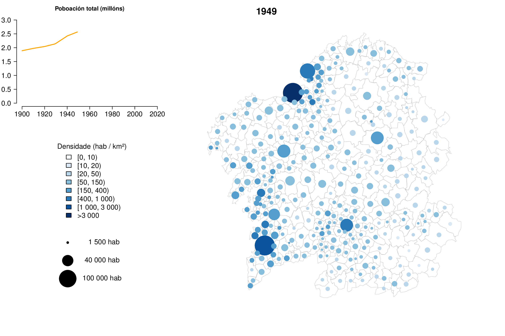

# Demographic change in Galicia (Spain), 1900-2011

## Animación dos cambios demográficos a nivel municipal en Galicia entre 1900 e 2011

Eduardo Corbelle Rico, marzo de 2016

Este proxecto utiliza datos históricos do Censo de Poboación a nivel municipal en Galicia para crear unha animación dos cambios ocorridos entre 1900 e 2011. Os datos orixinais, dispoñibles cada 10 anos, foron interpolados para facer as transicións máis suaves.

Os datos orixinais (non incluídos no repositorio) proceden do [http://www.ige.eu](Instituto Galego de Estatística). Os datos cartográficos proceden da [http://mapas.xunta.es/portada](Infraestrutura de Datos Espaciais de Galicia).

O ficheiro Diapos.pdf é un exemplo do resultado da animación utilizando LaTeX e beamer. A animación pódese apreciar cando se abre no Acrobat Reader de Adobe.
